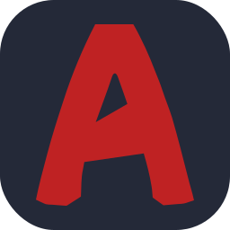
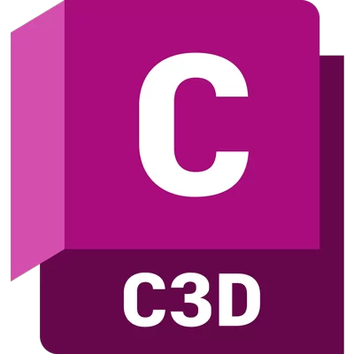

<h1 align="center">Hi, I'm Nahla Gamal</h1>

 
## ⚡ Here's Some Fun Facts About Me:

- 💻 I’m a **Front-End Developer**

- 💬 I am capable of solving working problems.

- 😄 Passionate about learning & development to reach the target.

- 🌱 [**UpWork Profile**](https://www.upwork.com/freelancers/~01918e72162a6ed4af)

- 📝 Get Details about me : [**Curriculum Vitae**](https://drive.google.com/file/d/1BjGY9anCVFUDSipELWdA6CoXEBk3qwXn/view?usp=drive_link)

- 📫 How to reach me: **Nahlagamal3125@gmail.com**
   

## 📫 Connect with me:

    

 
<h2 align="left">✨Languages and Tools:</h2>

 
&nbsp;
&nbsp;
&nbsp;
&nbsp;
&nbsp;
&nbsp;
&nbsp;
&nbsp;
&nbsp;
&nbsp;
&nbsp;
&nbsp;
&nbsp;

 
<h2 align="left">📜Certificates</h2>

<h4>
   
- <a href="https://s3-us-west-2.amazonaws.com/udacity-printer/production/certificates/b976b945-f674-41c6-80a6-aa6f1c0dae8d.pdf">Web Development - Challenger Track</a>

- <a href="https://maharatech.gov.eg/mod/customcert/view.php?id=7655&downloadown=1">Database Fundamentals - Mahara-Tech</a>
   
- <a href="https://www.freecodecamp.org/certification/Nahla_Abdo/responsive-web-design">Responsive Web Design - FreeCodeCamp</a>
  
</h4>
